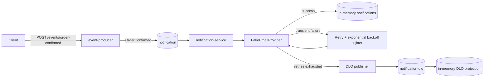
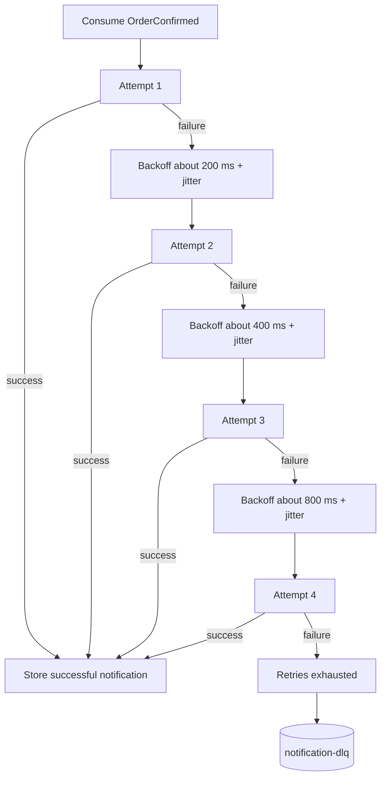

# 04 - Retry, Exponential Backoff and Dead Letter Queue

A deliberately small Quarkus + Kafka project that demonstrates reliable message processing when a downstream dependency is unreliable.

The important path is easy to see:

`OrderConfirmed -> notification -> retry with exponential backoff -> success OR notification-dlq`

## Stack

- Java 21
- Maven
- Quarkus 3.38.3
- Quarkus REST + Jackson
- Quarkus Messaging Kafka
- SmallRye Fault Tolerance
- Apache Kafka 4.3.1
- Docker Compose
- JUnit / QuarkusTest

## Structure

```text
04-retry-dlq/
├── event-producer/
├── notification-service/
├── docker-compose.yml
├── pom.xml
└── README.md
```

`event-producer` exposes `POST /events/order-confirmed` and publishes `OrderConfirmed` to Kafka topic `notification`.

`notification-service` consumes the event and calls `FakeEmailProvider`. The provider can be reconfigured at runtime to succeed, always fail, or fail the first N attempts. Retry is implemented with SmallRye Fault Tolerance using `@Retry` plus `@ExponentialBackoff`. After all attempts fail, the service publishes a failure envelope to Kafka topic `notification-dlq`.

There is intentionally no database. `GET /notifications` and `GET /admin/dlq` are in-memory projections so the retry/DLQ pattern remains the focus.

## Event

```json
{
  "eventId": "1c215948-d345-42ba-a12b-4e352b25da26",
  "orderId": "72c64a3d-741c-429a-9891-b20f48fdf5b2",
  "customerEmail": "customer@example.com",
  "occurredAt": "2026-08-22T18:30:00Z"
}
```

The producer generates `eventId` and `occurredAt`.

## Failure metadata written to the DLQ

```json
{
  "originalEvent": {
    "eventId": "1c215948-d345-42ba-a12b-4e352b25da26",
    "orderId": "72c64a3d-741c-429a-9891-b20f48fdf5b2",
    "customerEmail": "customer@example.com",
    "occurredAt": "2026-08-22T18:30:00Z"
  },
  "error": "Fake email provider failure for event 1c215948-d345-42ba-a12b-4e352b25da26 on attempt 4",
  "numberOfAttempts": 4,
  "failedAt": "2026-08-22T18:30:02Z"
}
```

## Architecture



## Retry flow

The retry policy is intentionally small enough to observe in logs:

- maximum retries: `3`
- maximum total attempts: `4`
- initial delay: `200 ms`
- exponential factor: `2`
- approximate delays: `200 ms`, `400 ms`, `800 ms`
- jitter: `±50 ms`
- maximum delay: `2 s`



With `FAIL_FIRST_N_ATTEMPTS = 3` the result is:

```text
attempt 1 -> failure
attempt 2 -> failure
attempt 3 -> failure
attempt 4 -> success
```

## Why retry?

A retry gives a transient problem another chance to recover without losing the event. Examples include a short network interruption, a temporary timeout, or an email provider returning a brief `503 Service Unavailable`.

Retry should not be unlimited. A permanently invalid request will never become valid just because it is executed again.

## Backoff

Backoff means waiting before retrying instead of retrying immediately. Without a delay, many failing consumers can hammer an already unhealthy dependency and make the incident worse.

## Exponential backoff

Exponential backoff increases the delay after each failure. With an initial delay of `200 ms` and factor `2`, the delays grow approximately like:

```text
200 ms -> 400 ms -> 800 ms
```

This reduces pressure on the failing dependency while still allowing fast recovery from brief failures.

## Jitter

If thousands of consumers fail at the same time and all use exactly the same backoff delays, they can retry at exactly the same time too. That synchronized retry spike is sometimes called a thundering herd.

Jitter adds a small random variation to each delay. This project uses `±50 ms`, so retries are spread slightly instead of becoming perfectly synchronized.

## Dead Letter Queue

A Dead Letter Queue is a separate destination for messages that could not be processed successfully after the retry policy was exhausted.

This project sends those events to:

```text
notification-dlq
```

The DLQ payload keeps:

- the original event
- the final error
- number of attempts
- failure timestamp

The original Kafka message is only considered handled after the DLQ publish completes. If publishing to the DLQ itself fails, the consumer invocation fails instead of silently losing the event.

### Why the application publishes the DLQ envelope explicitly

Quarkus Messaging Kafka also has a built-in `dead-letter-queue` failure strategy. That strategy is useful when a nacked Kafka record should be forwarded as-is with Kafka failure headers. This project publishes explicitly because the learning requirement is to make the DLQ payload itself contain `originalEvent`, `error`, `numberOfAttempts`, and `failedAt`. Keeping that transformation in one small class also makes the failure path obvious when reading the code.

## Transient vs permanent failures

A **transient failure** may disappear if we try again: network timeout, temporary provider outage, short database outage, rate limit window, and similar infrastructure problems.

A **permanent failure** is unlikely to improve through retry: malformed data, invalid email address, missing required business data, unsupported operation, or a rule violation.

In production, retry policies should usually target known transient exceptions and avoid retrying permanent failures.

## Fake email provider

The provider supports three runtime modes:

```text
ALWAYS_SUCCEED
ALWAYS_FAIL
FAIL_FIRST_N_ATTEMPTS
```

Change it without restarting `notification-service`:

```bash
curl -X POST http://localhost:8081/admin/email-provider/config \
  -H 'Content-Type: application/json' \
  -d '{"behavior":"FAIL_FIRST_N_ATTEMPTS","failFirstNAttempts":3}'
```

Changing the provider configuration resets its per-event attempt counters.

## Run the project

Requirements:

- Java 21
- Maven
- Docker + Docker Compose

Start Kafka:

```bash
docker compose up -d
```

Start the notification service in terminal 1:

```bash
mvn -pl notification-service quarkus:dev
```

Start the producer in terminal 2:

```bash
mvn -pl event-producer quarkus:dev
```

Ports:

```text
event-producer       http://localhost:8080
notification-service http://localhost:8081
Kafka                localhost:9092
```

## Scenario 1 - provider works immediately

Configure the provider:

```bash
curl -X POST http://localhost:8081/admin/email-provider/config \
  -H 'Content-Type: application/json' \
  -d '{"behavior":"ALWAYS_SUCCEED","failFirstNAttempts":0}'
```

Publish an event:

```bash
curl -X POST http://localhost:8080/events/order-confirmed \
  -H 'Content-Type: application/json' \
  -d '{
    "orderId":"11111111-1111-1111-1111-111111111111",
    "customerEmail":"success@example.com"
  }'
```

Inspect successful notifications:

```bash
curl http://localhost:8081/notifications
```

Expected result: one notification with `attempts: 1`, and no new DLQ record.

## Scenario 2 - provider fails twice and then succeeds

Configure the provider:

```bash
curl -X POST http://localhost:8081/admin/email-provider/config \
  -H 'Content-Type: application/json' \
  -d '{"behavior":"FAIL_FIRST_N_ATTEMPTS","failFirstNAttempts":2}'
```

Publish an event:

```bash
curl -X POST http://localhost:8080/events/order-confirmed \
  -H 'Content-Type: application/json' \
  -d '{
    "orderId":"22222222-2222-2222-2222-222222222222",
    "customerEmail":"retry@example.com"
  }'
```

Inspect successful notifications:

```bash
curl http://localhost:8081/notifications
```

Expected result: the new notification has `attempts: 3`.

Typical logs:

```text
Processing event abc - attempt 1
Email provider failed
Retrying event abc
Processing event abc - attempt 2
Email provider failed
Retrying event abc
Processing event abc - attempt 3
```

## Scenario 3 - provider always fails and event reaches the DLQ

Configure the provider:

```bash
curl -X POST http://localhost:8081/admin/email-provider/config \
  -H 'Content-Type: application/json' \
  -d '{"behavior":"ALWAYS_FAIL","failFirstNAttempts":0}'
```

Publish an event:

```bash
curl -X POST http://localhost:8080/events/order-confirmed \
  -H 'Content-Type: application/json' \
  -d '{
    "orderId":"33333333-3333-3333-3333-333333333333",
    "customerEmail":"dlq@example.com"
  }'
```

After the retry sequence finishes, inspect the DLQ projection:

```bash
curl http://localhost:8081/admin/dlq
```

Expected result: the new entry contains the original `OrderConfirmed`, the error, `numberOfAttempts: 4`, and `failedAt`.

Typical logs:

```text
Processing event abc - attempt 1
Email provider failed
Retrying event abc
Processing event abc - attempt 2
Email provider failed
Retrying event abc
Processing event abc - attempt 3
Email provider failed
Retrying event abc
Processing event abc - attempt 4
Email provider failed
Retries exhausted for event abc
Sending abc to notification-dlq
```

You can also inspect the Kafka topic directly:

```bash
docker exec -it retry-dlq-kafka /opt/kafka/bin/kafka-console-consumer.sh \
  --bootstrap-server localhost:9092 \
  --topic notification-dlq \
  --from-beginning
```

## Tests

The three requested cases are covered in `NotificationHandlerTest`:

```bash
mvn -pl notification-service test
```

The test Kafka-facing beans are excluded and a test DLQ publisher is used, so the retry behavior tests do not require a running Kafka broker.

Covered scenarios:

1. provider succeeds immediately -> one attempt
2. provider fails twice -> succeeds on attempt three
3. provider always fails -> four attempts -> failure is published to the test DLQ

## Endpoints

| Service | Method | Endpoint | Purpose |
|---|---|---|---|
| event-producer | POST | `/events/order-confirmed` | Publish a new `OrderConfirmed` event |
| notification-service | GET | `/notifications` | View successful notifications observed by this running instance |
| notification-service | GET | `/admin/dlq` | View DLQ events observed by this running instance |
| notification-service | POST | `/admin/email-provider/config` | Change fake provider behavior at runtime |

## Kafka topics

| Topic | Purpose |
|---|---|
| `notification` | Main `OrderConfirmed` stream |
| `notification-dlq` | Events that exhausted the retry policy |

## What this example intentionally does not add

No database, schema registry, framework-heavy abstraction, circuit breaker, replay endpoint, or distributed tracing is included. Those are useful in larger systems, but they would hide the retry/backoff/DLQ mechanics this project is meant to teach.
